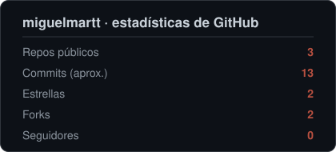

 

&nbsp;&nbsp;
&nbsp;&nbsp;

  

<!-- Banner de terminal generado con scripts/generate_terminal_banner.py -->
<picture>
  <source media="(prefers-color-scheme: dark)"  srcset="assets/terminal-dark.svg">
  <source media="(prefers-color-scheme: light)" srcset="assets/terminal-light.svg">
  
</picture>

---

## Sobre mí

Desarrollador full stack especializado en aplicaciones web y automatización de procesos con IA. Diseño y despliego soluciones a medida de principio a fin: desde la arquitectura de la base de datos hasta los flujos que vigilan la infraestructura sin intervención manual.

- Murcia, España
- **[verticedev.es](https://verticedev.es)** — desarrollo web y automatización para empresas
- Cursando **DAW** (Desarrollo de Aplicaciones Web) · XTART, Murcia
- Formación continua en analítica de datos e IA (ver Certificaciones)
- Disponible para proyectos y oportunidades: **miguelmartt7@gmail.com**

---

## Stack Técnico

**Desarrollo web**

**Automatización**

**Despliegue**

**IA**

---

## Proyectos

### Automatización de procesos

Diseño flujos que eliminan tareas manuales y vigilan la infraestructura sin que nadie tenga que estar pendiente:

- **Monitorización y alertas en tiempo real** — servicios, uptime, copias de seguridad, certificados SSL y seguridad.
- **Integraciones entre aplicaciones** — web → CRM/hoja de cálculo, webhooks y APIs REST.
- **Bots de Telegram** — alertas, comandos y asistentes con IA.
- **Flujos con IA / LLM** — resúmenes, digests y agentes operativos.
- **Scripting y ETL con Python** — datos → PDF, email o base de datos.

**VertiGuard — Monitorización de servidores** · _producto propio_
> Suite de vigilancia para VPS construida en n8n. Comprueba servicios (nginx, MariaDB, n8n), uso de disco/RAM, caducidad de certificados SSL, copias de seguridad en la nube, intentos de intrusión y disponibilidad externa; avisa por Telegram solo cuando algo cambia. Incluye un agente DevOps con IA que ejecuta diagnósticos bajo demanda. **8 módulos en producción.**

---

### Open Source

**vertice-automations** · _[github.com/miguelmartt/vertice-automations](https://github.com/miguelmartt/vertice-automations)_
> Repositorio público con mis flujos de n8n documentados y saneados, listos para reutilizar (empezando por la familia VertiGuard). Documentación bilingüe e integración continua que valida los JSON y escanea credenciales. Voy publicando aquí cada automatización.

**biwenger-agent** · _[github.com/miguelmartt/biwenger-agent](https://github.com/miguelmartt/biwenger-agent)_
> Bot de Telegram para jugar a Biwenger (fantasy football) de forma más óptima, desplegado en Docker sobre mi propio VPS.

---

## Experiencia

### Desarrollador Full Stack — [VérticeDev](https://verticedev.es)
**Autónomo · Murcia · mar. 2026 – Actualidad**

- Auditoría técnica de procesos internos y diseño de soluciones de digitalización para PYMEs.
- Desarrollo backend y frontend de plataformas web orientadas al rendimiento.
- Automatización de procesos con n8n, Python e integraciones por API: monitorización, alertas, captura de leads e informes.
- Diseño e implementación de arquitecturas de bases de datos relacionales.
- Despliegue y administración de sistemas en entornos seguros (VPS Linux).

### Monitor Informático — HARTFORD SL
**Jornada parcial · Cieza, Murcia · mar. 2025 – ago. 2025**

- Formación en herramientas digitales e informática básica para personas mayores.
- Resolución de incidencias técnicas y soporte personalizado a usuarios.

---

## Formación

| Título | Centro | Año |
|--------|--------|-----|
| Desarrollo de Aplicaciones Web (DAW) | XTART FP, Murcia | 2025 – Actualidad |
| Ciencias Políticas y Gestión Pública | Univ. del País Vasco (UPV/EHU) · Univ. de Murcia (UMU) | 2020 – 2023 |
| Bachillerato | IES Diego Tortosa, Cieza | 2018 – 2020 |

**Certificaciones**

-000000?style=for-the-badge&logo=bloomberg&logoColor=white)

---

## Idiomas

| Idioma | Nivel |
|--------|-------|
| Español | Nativo |
| Inglés | Intermedio |

---

## Actividad en GitHub

<table>
<tr>
<td width="50%" align="center" valign="middle">

<!-- Radar autoevaluado - editar assets/skills.json, el workflow lo regenera -->
<picture>
  <source media="(prefers-color-scheme: dark)"  srcset="assets/radar-dark.svg">
  <source media="(prefers-color-scheme: light)" srcset="assets/radar-light.svg">
  
</picture>

</td>
<td width="50%" align="center" valign="middle">

<!-- Tarjeta de estadísticas generada con scripts propios (scripts/generate_stats_card.py) -->
<picture>
  <source media="(prefers-color-scheme: dark)"  srcset="assets/card-stats-dark.svg">
  <source media="(prefers-color-scheme: light)" srcset="assets/card-stats-light.svg">
  
</picture>

</td>
</tr>
</table>

---

<!-- Generado cada día por .github/workflows/snake.yml (acción Platane/snk) -->
<picture>
  <source media="(prefers-color-scheme: dark)"  srcset="https://raw.githubusercontent.com/miguelmartt/miguelmartt/output/snake-dark.svg">
  <source media="(prefers-color-scheme: light)" srcset="https://raw.githubusercontent.com/miguelmartt/miguelmartt/output/snake-light.svg">
  
</picture>

---

Murcia, España · Disponible para proyectos freelance y oportunidades profesionales

